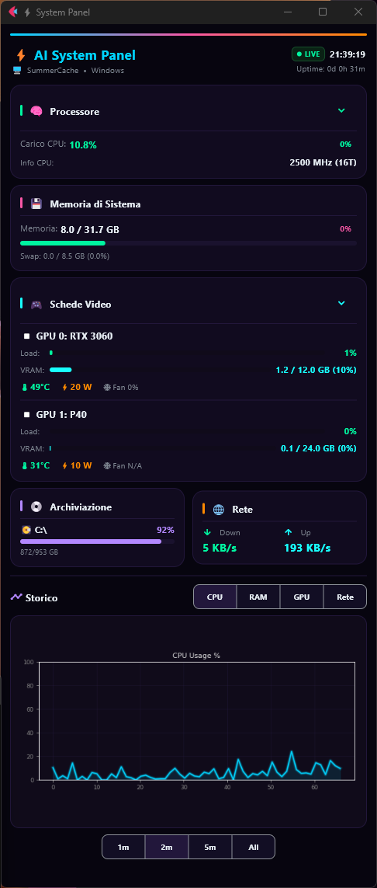
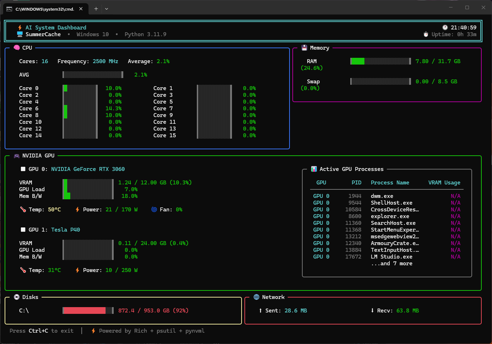

# ⚡ sys_info — AI System Dashboard

Real-time hardware monitoring dashboard in three flavors: slick terminal UI, Flet desktop GUI, and matplotlib-based technical view.



## Features

- **CPU** — per-core load bars, average %, frequency
- **RAM** — usage %, used/total GB, swap
- **GPU** (NVIDIA) — temperature, load, VRAM, power draw, fan speed, running processes
- **Disks** — per-partition usage bars
- **Network** — real-time up/down throughput (KB/s)
- **AI inference** — detects local inference engines (Ollama, llama.cpp, LM Studio, GPT4All, AnythingLLM, Unsloth Studio, KoboldCpp, vLLM, ...) and shows the engine + model loaded in memory + memory footprint
- **Live charts** — configurable time window (1m / 2m / 5m / all) with CPU, RAM, GPU, Network history
- **Multi-GPU charts** — the GPU chart plots **every** NVIDIA GPU (e.g. RTX 3060 + Tesla P40) on a single dual-axis graph, or lets you pick a single GPU from a selector
- **GPU focus selector (terminal)** — in `main.py`, press `G` to cycle the focused GPU (overview → RTX 3060 → Tesla P40 → …) and see a single-GPU detail view with its processes
- **Alert thresholds** — CPU warn 80%, RAM warn 80%, GPU temp warn 75°C / danger 85°C

## Screens

| Mode | File | Tech | Vibe |
|------|------|------|------|
| Terminal | `main.py` | [Rich](https://github.com/Textualize/rich) | Cyberpunk terminal chic |
| GUI | `main_flet.py` | [Flet](https://flet.dev) | Dark neon desktop app |
| Technical | `main_graph.py` | Matplotlib + LibreHardwareMonitor | Full-sensor plotting |



## Quick Start

```bash
# Create venv
python -m venv .venv
.venv\Scripts\activate       # Windows
# source .venv/bin/activate  # Linux/macOS

# Install
pip install -r requirements.txt

# Run
python main.py                # Rich terminal dashboard
python main_flet.py           # Flet desktop GUI
python main_graph.py          # Matplotlib+LHM technical view
```

Or use the launcher scripts:

| Launcher | OS | Runs |
|----------|----|------|
| `run_dashboard.bat` / `.sh` | Win / Linux | `main.py` |
| `run_flet.bat` / `.sh` | Win / Linux | `main_flet.py` |
| `run_tesla_panel.bat` / `.sh` | Win / Linux | `main_graph.py` |

## Requirements

```
rich>=13
psutil>=5.9
pynvml>=11.5
flet>=0.23
matplotlib>=3.7
keyboard>=0.13
```

> **Linux note:** `keyboard` requires root on Linux. Install via `pip` but run dashboards without it:
> ```bash
> pip install -r requirements.txt
> # keyboard not needed for main.py / main_flet.py
> ```

## Platform Compatibility

| Dashboard | Windows | Linux | Notes |
|-----------|---------|-------|-------|
| `main.py` (Rich TUI) | ✅ | ✅ | psutil + pynvml — fully cross-platform |
| `main_flet.py` (Flet GUI) | ✅ | ✅ | Same data layer — works anywhere |
| `main_graph.py` (Matplotlib) | ✅ | ⚠️ | LHM sensors are Windows-only; NVML works on Linux with NVIDIA drivers |

`main_graph.py` gracefully degrades on Linux: LHM-dependent sensors (fan RPM/PWM, advanced CPU metrics)
are silently skipped. GPU data via NVML still works. The dashboard runs, just with fewer sensors.

## Project Structure

```
sys_info/
├── main.py              # Rich terminal dashboard
├── main_flet.py         # Flet GUI entry point
├── main_graph.py        # Matplotlib Tesla Monitor
├── dashboard.py         # Flet Dashboard class
├── data_collector.py    # psutil + pynvml data layer
├── ai_detector.py       # Local AI inference engine detector (engine + model in memory)
├── charts.py            # Matplotlib chart renderers
├── config.py            # Theme & config loader
├── config.json          # Thresholds & defaults
├── panels/              # Modular dashboard panels
│   ├── cpu_panel.py
│   ├── ram_panel.py
│   ├── gpu_panel.py
│   ├── disk_panel.py
│   ├── network_panel.py
│   ├── charts_panel.py
│   └── utils.py
├── lhm/                 # LibreHardwareMonitor (external .NET app)
└── resources/           # Screenshots
```

## Configuration

Edit `config.json`:
```json
{
  "refresh_ms": 1000,
  "history_points": 60,
  "chart_refresh_s": 3,
  "thresholds": {
    "cpu_warn": 80,
    "ram_warn": 80,
    "gpu_temp_warn": 75,
    "gpu_temp_danger": 85
  }
}
```

## License

MIT

## TODO / Roadmap

- [ ] **Linux sensor support for `main_graph.py`** — replace LibreHardwareMonitor (Windows/.NET)
      with `lm-sensors` or `/sys/class/hwmon` on Linux to recover fan RPM, PWM, and advanced
      CPU temperature metrics. The dashboard already works without LHM but shows fewer sensors.
- [ ] **macOS support** — test and adapt sensor paths (NVML works, psutil works, no LHM).
- [ ] **AMD GPU support** — currently NVIDIA-only via NVML. Add ROCm SMI or `amdgpu` sysfs.
- [ ] **Packaging** — `pyinstaller` / `briefcase` one-click .exe for Windows, AppImage for Linux.
- [ ] **System tray** — minimize to tray with quick-glance tooltip showing CPU/GPU temps.
